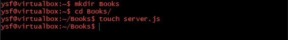

# What is MEAN STACK
### MEAN stands for MongoDB, Express.js, AngularJS, and Node.js. MEAN is an end-to-end JavaScript stack largely used for cloud-ready applications. MEAN is a full-stack development toolkit which is also refer to as a collection of JavaScript technologies used to develop web applications from the client to the server and from server to database, everything is based on JavaScript. It is also free and open-source stack which offers a quick and organized method for creating rapid prototypes for web-based applications.

<p></p>

## MEAN STACK is comprised of four different technologies:
* MongoDB (Document database): Stores and retrieve data.
* Express JS (Back-end application framework): Makes requests to Database and return a response
* AngularJS (Front-end application framework): Handles Client and Server Requests
* Node.js (JavaScript runtime environment): Accept requests and display results to end user


<p></p>

# MEAN STACK COMPONENTS

## MongoDB
### MongoDB is an open source, NoSQL database designed for cloud applications. It uses object-oriented organization instead of a relational model. It stores data in the key-value pair, using binary data type like JSON. MongoDB is an ideal choice for a database system where we need to manage large sized tables with millions of data. Moreover, including a field to MongoDB is easier as it does not require updating the entire table. With MongoDB we can develop an entire application with just one application which is JavaScript.


## Express
### Express is a mature, flexible, lightweight server framework. It is designed for building single, multi-page, and hybrid web applications. This lightweight framework uses the Pug engine to provide support for templates. Express is a web application framework for Node.js. It handles all the interactions between the frontend and the database, ensuring a smooth transfer of data to the end user. 


## Angular
### Angular JS is an open-source JavaScript framework and it is maintained by Google. The goal of this framework is to introduce MVC(Model View Controller) architecture in the browser-based application that makes the development and testing process easier. The framework helps us create a smarter web app that supports personalization.

### AngularJS allows us to use HTML as a template language. Therefore, we can extend HTML's syntax to express the components of our application. Angular features like dependency injection and data binding eliminate plenty of code that we need to write.


## Node.js
### Node.js is an open source JavaScript framework that uses asynchronous events to process multiple connections simultaneously. It allows developers to create web servers and build web applications on it. It's a server-side Javascript execution environment and also an ideal framework for a cloud-based application, as it can effortlessly scale requests on demand. 

### Node.js uses a non-blocking and event-driven I/O model. This makes it lightweight and efficient, perfect for data-intensive real-time applications that run across distributed devices. We’re likely to find Node.js behind most well-known web presences.
<p>


# MEAN STACK USE CASES
### While the MEAN stack isn’t perfect for every application, there are many uses where it excels. It’s a strong choice for developing cloud native applications because of its scalability and its ability to manage concurrent users. The AngularJS frontend framework also makes it ideal for developing single-page applications that serve all information and functionality on a single page. Here are a few examples for using MEAN:

* Calendars
* Expense tracking
* News aggregation sites
* Mapping and location finding


## In this Project we are going to deploy a web based application on our Linux server using MEAN STACK with the following steps.

# Step1: Install NodeJs
### We will install nodejs on our server

* Run the command:
```
$ sudo apt -y install nodejs
```

# Step 2: Install MongoDB
### MongoDB stores data in flexible, JSON-like documents. Fields in a database can vary from document to document and data structure can be changed over time. For our example application, we are adding book records to MongoDB that contain book name, isbn number, author, and number of pages.

* Run these commands:
```
$ sudo apt-key adv --keyserver hkp://keyserver.ubuntu.com:80 --recv 0C49F3730359A14518585931BC711F9BA15703C6
```
We should see output like this:


```
$ echo "deb [ arch=amd64 ] https://repo.mongodb.org/apt/ubuntu trusty/mongodb-org/3.4 multiverse" | sudo tee /etc/apt/sources.list.d/mongodb-org-3.4.list
```
We should see output like this:


## Our next step is to update the package manager with the following commands.

* Run the command:
```
$ sudo apt update
```

* Install MongoDB
```
$ sudo apt -y install mongodb
```

* We can start our server with this command:
```
$ sudo systemctl start mongodb
```

* We check if our server is running with the command:
```
$ sudo systemctl status mongodb
```
We should see output like this:


## We also need to install the body-parser package to help us process the JSON passed in requests to the server.

* But first we need to install the the npm package manager.
```
$ sudo apt install npm
```

* We Create a folder named Books for our website
```
$ mkdir Books
```

* change the directory the *Books* we just created
```
$ cd Books
```

* We need to add a file to it named server.js
```
$ touch server.js
```
We should see output like this:



* We need paste the web server code below into the server.js file.

```
var express = require('express');
var bodyParser = require('body-parser');
var app = express();
app.use(express.static('./public'));
app.use(bodyParser.json());
require('./apps/routes')(app);
app.set('port', 3300);
app.listen(app.get('port'), function() {
    console.log('Server up: http://localhost:' + app.get('port'));
});
```
We should see output like this:


# Step 3: Install Express and set up routes to the server
### Express is a minimal and flexible Node.js web application framework that provides features for web and mobile applications. Express is used in this project to pass book information to and from our MongoDB database. Mongoose provides a straight-forward, schema-based solution to model your application data. Mongoose is used in this project to provide a book schema for the database. 

* We need to install express and mongoose on our server by this command:

```
$ sudo npm install express mongoose
```
We should see something like this


### In the Books folder.

* Create a folder named apps
```
$ mkdir apps
```

* Move into apps folder
```
$ cd apps
```

* Add a file named routes.js
```
$ nano routes.js
```
We should see something like this:


* Paste the code below into routes.js
```
var Book = require('./models/book');
module.exports = function(app) {
  app.get('/book', function(req, res) {
    Book.find({}, function(err, result) {
      if ( err ) throw err;
      res.json(result);
    });
  }); 
  app.post('/book', function(req, res) {
    var book = new Book( {
      name:req.body.name,
      isbn:req.body.isbn,
      author:req.body.author,
      pages:req.body.pages
    });
    book.save(function(err, result) {
      if ( err ) throw err;
      res.json( {
        message:"Successfully added book",
        book:result
      });
    });
  });
  app.delete("/book/:isbn", function(req, res) {
    Book.findOneAndRemove(req.query, function(err, result) {
      if ( err ) throw err;
      res.json( {
        message: "Successfully deleted the book",
        book: result
      });
    });
  });
  var path = require('path');
  app.get('*', function(req, res) {
    res.sendfile(path.join('/Books' + '/public', 'index.html'));
  });
};
```
We should see something like this,


* In the apps folder, create a folder named models
```
$ mkdir models
```

* Add a file named book.js
```
$ nano book.js
```


* Paste the code below into book.js

```
var mongoose = require('mongoose');
var dbHost = 'mongodb://localhost:27017/test';
mongoose.connect(dbHost);
mongoose.connection;
mongoose.set('debug', true);
var bookSchema = mongoose.Schema( {
  name: String,
  isbn: {type: String, index: true},
  author: String,
  pages: Number
});
var Book = mongoose.model('Book', bookSchema);
module.exports = mongoose.model('Book', bookSchema);
```
We should see something like this,


# Step 4: Access the routes with AngularJS
### AngularJS provides a web framework for creating dynamic views in our web applications. In this project, we use AngularJS to connect our web page with Express and perform actions on our book database.

* Change the directory back up to Books
```
$ cd ../..
```

* Create a folder named public
```
$ mkdir public
```

* Move into public
```
$ cd public
```

* Add a file named script.js
```
$ nano script.js
```

We should see something like this,


* Paste the Code below (controller configuration defined) into the script.js file.

```
var app = angular.module('myApp', []);
app.controller('myCtrl', function($scope, $http) {
  $http( {
    method: 'GET',
    url: '/book'
  }).then(function successCallback(response) {
    $scope.books = response.data;
  }, function errorCallback(response) {
    console.log('Error: ' + response);
  });
  $scope.del_book = function(book) {
    $http( {
      method: 'DELETE',
      url: '/book/:isbn',
      params: {'isbn': book.isbn}
    }).then(function successCallback(response) {
      console.log(response);
    }, function errorCallback(response) {
      console.log('Error: ' + response);
    });
  };
  $scope.add_book = function() {
    var body = '{ "name": "' + $scope.Name + 
    '", "isbn": "' + $scope.Isbn +
    '", "author": "' + $scope.Author + 
    '", "pages": "' + $scope.Pages + '" }';
    $http({
      method: 'POST',
      url: '/book',
      data: body
    }).then(function successCallback(response) {
      console.log(response);
    }, function errorCallback(response) {
      console.log('Error: ' + response);
    });
  };
});
```

We should see something like this,


* In the public folder, create a file named index.html
```
$ nano index.html
```

* Paste the code below into index.html file.

```HTML
<!doctype html>
<html ng-app="myApp" ng-controller="myCtrl">
  <head>
    <script src="https://ajax.googleapis.com/ajax/libs/angularjs/1.6.4/angular.min.js"></script>
    <script src="script.js"></script>
  </head>
  <body>
    <div>
      <table>
        <tr>
          <td>Name:</td> 
          <td><input type="text" ng-model="Name"></td>
        </tr>
        <tr>
          <td>Isbn:</td>
          <td><input type="text" ng-model="Isbn"></td>
        </tr>
        <tr>
          <td>Author:</td> 
          <td><input type="text" ng-model="Author"></td>
        </tr>
        <tr>
          <td>Pages:</td>
          <td><input type="number" ng-model="Pages"></td>
        </tr>
      </table>
      <button ng-click="add_book()">Add</button>
    </div>
    <hr>
    <div>
      <table>
        <tr>
          <th>Name</th>
          <th>Isbn</th>
          <th>Author</th>
          <th>Pages</th>
        </tr>
        <tr ng-repeat="book in books">
          <td><input type="button" value="Delete" data-ng-click="del_book(book)"></td>
          <td>{{book.name}}</td>
          <td>{{book.isbn}}</td>
          <td>{{book.author}}</td>
          <td>{{book.pages}}</td>
        </tr>
      </table>
    </div>
  </body>
</html>
```
We should see something like this,


* Change the directory back up to Books
```
$ cd ..
```

* Start the server by running this command:
```
$ node server.js
```

We should see something like this,


## If our configuration setup and the scripts are all working fine we should get the below image as our test page that makes our webpage go live.


# CREDITS
## https://progressive-pbl.darey.io/en/latest/project4.html
## https://www.guru99.com/mean-stack-developer.html
## https://www.geeksforgeeks.org/introduction-to-mean-stack/
## https://www.mongodb.com/mean-stack
## https://jeremyvsjeremy.medium.com/what-is-the-mean-stack-9d11ae2cd384


